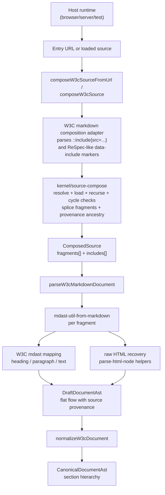
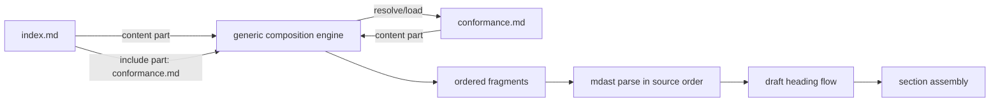

# @spectotal/profile-w3c

W3C profile package for Spectotal.

## Markdown Flow





The important boundary is:

- `@spectotal/profile-w3c` owns parser-backed include recognition and mdast-to-W3C parsing.
- `@spectotal/source-compose` stays markup-agnostic and only handles composition mechanics.
- Assembly happens after parsing, so headings are first emitted as flat draft flow and only later normalized into `section` nodes.

## Schema Artifacts

The W3C structural schema is authored once in `src/schema/w3c.schema-source.ts`.
That source now uses named content groups plus three generic HTML/custom element kinds:

- `flowElement`
- `phrasingElement`
- `voidElement`

Actual HTML tag names stay in `tagName`. The parsing layer classifies known tags into one of
those node kinds and defaults custom tags to `flowElement`, so the schema does not need a
separate node kind per tag.

Regenerate checked-in schema artifacts:

```bash
pnpm run schema:generate
```

Check for drift without rewriting files:

```bash
pnpm run schema:check
```
