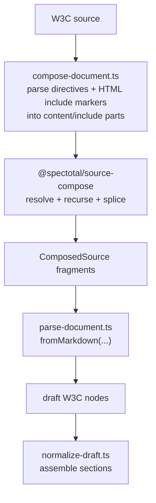

# parse

Current v1 layout:

- `../compose/compose-document.ts`
- `parse-document.ts`
- `parse-html-node.ts`
- `../normalize/normalize-draft.ts`

Important boundary:

- parser-backed include recognition happens in `../compose/compose-document.ts`
- generic recursion, cycle checks, and fragment splicing happen in `@spectotal/source-compose`
- mdast draft parsing starts only after composition has produced ordered fragments

That means there is intentionally no `parse-include.ts` in the current shape. Include syntax is profile-owned, but it is recognized during composition, not during mdast-to-draft mapping.

High-level flow:

`parse-html-node.ts` now owns the generic HTML tag classification used by the schema:
void tags map to `voidElement`, phrasing tags map to `phrasingElement`, and everything else
defaults to `flowElement`.
